# 🛒 API MINI MARKET F.J - Documentación


**Desarrollador:** Fernando Daniel Vaca Buitrón  
**Contacto:** fdvaca@puce.edu.ec

---

## 📋 Tabla de Contenidos

- [Introducción](#introducción)
- [Tecnologías Utilizadas](#tecnologías-utilizadas)
- [Instalación y Configuración](#instalación-y-configuración)
  - [Instalación con Docker (Producción)](#instalación-con-docker-producción)
  - [Instalación con Docker Compose (Desarrollo Local)](#instalación-con-docker-compose-desarrollo-local)
  - [Instalación Manual](#instalación-manual)
- [URL Base](#url-base)
- [Estructura del Proyecto](#estructura-del-proyecto)
- [Endpoints](#endpoints)
  - [Módulo Usuarios](#módulo-usuarios)
  - [Módulo Productos](#módulo-productos)
  - [Módulo Pedidos](#módulo-pedidos)
- [Códigos de Respuesta](#códigos-de-respuesta)
- [Estructura de Respuestas](#estructura-de-respuestas)
- [Ejemplo de Flujo Completo](#ejemplo-de-flujo-completo)

---

## Introducción de la API

Esta API REST proporciona servicios para la gestión de un minimarket, permitiendo administrar usuarios, productos y pedidos de forma eficiente y segura. La API facilita operaciones CRUD completas para cada módulo, brindando una solución integral para el manejo de un negocio de retail.

**Características principales:**
- ✅ Gestión completa de usuarios (registro, autenticación, CRUD)
- ✅ Administración de inventario de productos
- ✅ Sistema de pedidos con seguimiento de estado
- ✅ Validación de datos robusta
- ✅ Respuestas estructuradas en formato JSON
- ✅ Dockerizado para fácil despliegue
- ✅ Compatible con desarrollo local mediante Docker Compose

---

## 🛠 Tecnologías Utilizadas

- **Backend:** Node.js + Express.js
- **Base de Datos:** Supabase (PostgreSQL) / PostgreSQL Local
- **Hosting:** Railway
- **Autenticación:** Sistema de login con credenciales
- **Containerización:** Docker & Docker Compose
- **ORM/Database Client:** PostgreSQL Client

---

## 🌐 URL Base

**Producción (Railway):**
```
https://minimarket-jk-backend-production.up.railway.app/api
```

**Desarrollo Local:**
```
http://localhost:4000/api
```

---

## 📥 Instalación y Configuración

### Instalación con Docker (Producción)

Si deseas desplegar la aplicación en un servidor, utiliza el Dockerfile:

```bash
# Construir la imagen
docker build -t minimarket-api .

# Ejecutar el contenedor
docker run -p 4000:4000 --env-file .env minimarket-api
```

**Dockerfile:**
```dockerfile
FROM node:20-alpine

WORKDIR /app
COPY package*.json ./
RUN npm install
COPY . .
EXPOSE 4000

CMD ["npm", "run", "start"]
```

---

### Instalación con Docker Compose (Desarrollo Local)

Para trabajar en desarrollo local con base de datos PostgreSQL incluida:

```bash
# Clonar el repositorio
git clone https://github.com/tu-usuario/minimarket-jk-backend.git
cd minimarket-jk-backend

# Crear archivo .env (ver configuración abajo)
cp .env.example .env

# Iniciar los servicios
docker-compose up -d

# Ver logs
docker-compose logs -f

# Detener los servicios
docker-compose down
```

**docker-compose.yml:**
```yaml
services:
  api:
    build: .
    container_name: minimarket_api
    ports:
      - "4000:4000"
    env_file:
      - .env
    depends_on:
      - postgres
    restart: always

  postgres:
    image: postgres:15
    container_name: minimarket_db
    environment:
      POSTGRES_USER: ferxav_backend
      POSTGRES_PASSWORD: 123456
      POSTGRES_DB: minimarket_jk
    ports:
      - "5432:5432"
    volumes:
      - postgres_data:/var/lib/postgresql/data
    restart: always

volumes:
  postgres_data:
```

**Configuración del archivo .env:**
```env
# Servidor
PORT=4000
NODE_ENV=development

# Base de datos (Docker Compose local)
DB_HOST=postgres
DB_PORT=5432
DB_USER=tu_usuario_db
DB_PASSWORD=tu_password_db
DB_NAME=nombre_base_datos

# Producción (ejemplo Supabase)
# DB_HOST=tu-proyecto.supabase.co
# DB_PORT=5432
# DB_USER=postgres
# DB_PASSWORD=tu_password
# DB_NAME=postgres
```
---

### Instalación Manual

Si prefieres ejecutar la aplicación sin Docker:

```bash
# Clonar el repositorio
git clone https://github.com/tu-usuario/minimarket-jk-backend.git
cd minimarket-jk-backend

# Instalar dependencias
npm install

# Configurar variables de entorno
cp .env.example .env
# Editar .env con tus credenciales

# Iniciar el servidor
npm start

# Para desarrollo con auto-reload
npm run dev
```

---

## 📁 Estructura del Proyecto

```
MINIMARKET-JK-BACKEND/
├── node_modules/
├── src/
│   ├── config/
│   │   ├── cloudinary.js
│   │   ├── database.js
│   │   └── multerCloud.js
│   ├── controllers/
│   │   ├── pedidoController.js
│   │   ├── productoController.js
│   │   └── usuarioController.js
│   ├── middlewares/
│   ├── models/
│   │   ├── Pedido.js
│   │   ├── Producto.js
│   │   ├── Relaciones.js
│   │   └── Usuario.js
│   ├── routes/
│   │   ├── pedidoRoutes.js
│   │   ├── productoRoutes.js
│   │   └── usuarioRoutes.js
│   ├── app.js
│   └── server.js
├── .env
├── .gitignore
├── docker-compose.yml
├── Dockerfile
└── package.json
```

---

## 📡 Endpoints

### Módulo Usuarios

#### 1. Registrar Usuario

Crea un nuevo usuario en el sistema.

- **Endpoint:** `/usuarios/registrar`
- **Método:** `POST`
- **Autenticación:** No requerida

**Parámetros del Body:**

| Campo | Tipo | Requerido | Descripción |
|-------|------|-----------|-------------|
| nombre | string | Sí | Nombre completo del usuario |
| correo | string | Sí | Correo electrónico único |
| contraseña | string | Sí | Contraseña del usuario |

**Request Body:**
```json
{
  "nombre": "Juan Perez",
  "correo": "juanperez@mail.com",
  "contraseña": "123456"
}
```

**Configuración en Postman:**
- **Method:** POST
- **URL:** `https://minimarket-jk-backend-production.up.railway.app/api/usuarios/registrar`
- **Headers:** Content-Type: application/json
- **Body:** raw → JSON

**Ejemplo cURL:**
```bash
curl -X POST https://minimarket-jk-backend-production.up.railway.app/api/usuarios/registrar \
  -H "Content-Type: application/json" \
  -d '{
    "nombre": "Juan Perez",
    "correo": "juanperez@mail.com",
    "contraseña": "123456"
  }'
```

**Ejemplo JavaScript:**
```javascript
const registrarUsuario = async () => {
  const response = await fetch('https://minimarket-jk-backend-production.up.railway.app/api/usuarios/registrar', {
    method: 'POST',
    headers: {
      'Content-Type': 'application/json'
    },
    body: JSON.stringify({
      nombre: "Juan Perez",
      correo: "juanperez@mail.com",
      contraseña: "123456"
    })
  });
  
  const data = await response.json();
  console.log(data);
};
```

**Ejemplo Python:**
```python
import requests

url = "https://minimarket-jk-backend-production.up.railway.app/api/usuarios/registrar"
payload = {
    "nombre": "Juan Perez",
    "correo": "juanperez@mail.com",
    "contraseña": "123456"
}

response = requests.post(url, json=payload)
print(response.json())
```

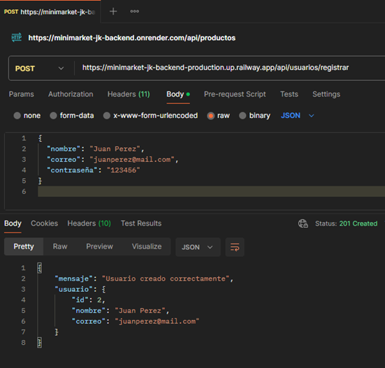

---

#### 2. Inicio de Sesión

Autentica a un usuario existente en el sistema.

- **Endpoint:** `/usuarios/login`
- **Método:** `POST`
- **Autenticación:** No requerida

**Parámetros del Body:**

| Campo | Tipo | Requerido | Descripción |
|-------|------|-----------|-------------|
| correo | string | Sí | Correo electrónico del usuario |
| contrasena | string | Sí | Contraseña del usuario |

**Request Body:**
```json
{
  "correo": "juanperez@mail.com",
  "contrasena": "123456"
}
```

**Configuración en Postman:**
- **Method:** POST
- **URL:** `https://minimarket-jk-backend-production.up.railway.app/api/usuarios/login`
- **Headers:** Content-Type: application/json
- **Body:** raw → JSON

**Ejemplo cURL:**
```bash
curl -X POST https://minimarket-jk-backend-production.up.railway.app/api/usuarios/login \
  -H "Content-Type: application/json" \
  -d '{
    "correo": "juanperez@mail.com",
    "contrasena": "123456"
  }'
```

**Ejemplo JavaScript:**
```javascript
const iniciarSesion = async () => {
  const response = await fetch('https://minimarket-jk-backend-production.up.railway.app/api/usuarios/login', {
    method: 'POST',
    headers: {
      'Content-Type': 'application/json'
    },
    body: JSON.stringify({
      correo: "juanperez@mail.com",
      contrasena: "123456"
    })
  });
  
  const data = await response.json();
  console.log(data);
};
```

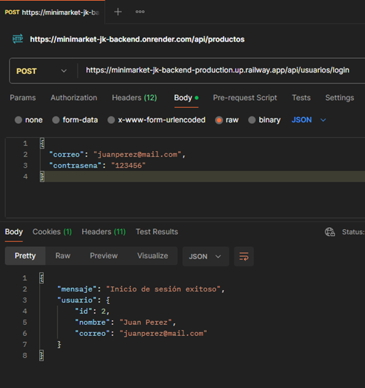

---

#### 3. Listar Usuarios

Obtiene la lista de todos los usuarios registrados.

- **Endpoint:** `/usuarios/listar`
- **Método:** `GET`
- **Autenticación:** No especificada
- **Body:** No requiere

**Configuración en Postman:**
- **Method:** GET
- **URL:** `https://minimarket-jk-backend-production.up.railway.app/api/usuarios/listar`
- **Headers:** Content-Type: application/json

**Ejemplo cURL:**
```bash
curl -X GET https://minimarket-jk-backend-production.up.railway.app/api/usuarios/listar
```

**Ejemplo JavaScript:**
```javascript
const listarUsuarios = async () => {
  const response = await fetch('https://minimarket-jk-backend-production.up.railway.app/api/usuarios/listar', {
    method: 'GET',
    headers: {
      'Content-Type': 'application/json'
    }
  });
  
  const data = await response.json();
  console.log(data);
};
```

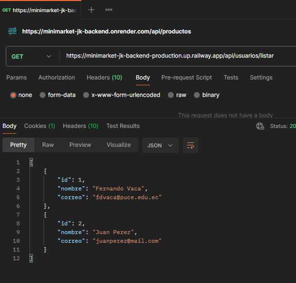

---

#### 4. Obtener Usuario por ID

Obtiene la información de un usuario específico mediante su ID.

- **Endpoint:** `/usuarios/{id}`
- **Método:** `GET`
- **Autenticación:** No especificada
- **Body:** No requiere

**Parámetros de URL:**

| Parámetro | Tipo | Descripción |
|-----------|------|-------------|
| id | string/number | ID del usuario a consultar |

**Configuración en Postman:**
- **Method:** GET
- **URL:** `https://minimarket-jk-backend-production.up.railway.app/api/usuarios/{id}`
- **Headers:** Content-Type: application/json

**Ejemplo cURL:**
```bash
curl -X GET https://minimarket-jk-backend-production.up.railway.app/api/usuarios/1
```

**Ejemplo JavaScript:**
```javascript
const obtenerUsuarioPorId = async (id) => {
  const response = await fetch(`https://minimarket-jk-backend-production.up.railway.app/api/usuarios/${id}`, {
    method: 'GET',
    headers: {
      'Content-Type': 'application/json'
    }
  });
  
  const data = await response.json();
  console.log(data);
};

// Uso
obtenerUsuarioPorId(1);
```

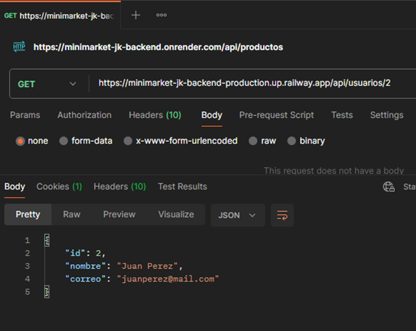

---

#### 5. Actualizar Usuario

Actualiza la información de un usuario existente.

- **Endpoint:** `/usuarios/{id}`
- **Método:** `PUT`
- **Autenticación:** No especificada

**Parámetros de URL:**

| Parámetro | Tipo | Descripción |
|-----------|------|-------------|
| id | string/number | ID del usuario a actualizar |

**Parámetros del Body:**

| Campo | Tipo | Requerido | Descripción |
|-------|------|-----------|-------------|
| nombre | string | No | Nuevo nombre del usuario |
| correo | string | No | Nuevo correo electrónico |
| contraseña | string | No | Nueva contraseña |

**Request Body (actualización parcial):**
```json
{
  "nombre": "Juan Perez Actualizado"
}
```

**Configuración en Postman:**
- **Method:** PUT
- **URL:** `https://minimarket-jk-backend-production.up.railway.app/api/usuarios/{id}`
- **Headers:** Content-Type: application/json
- **Body:** raw → JSON

**Ejemplo cURL:**
```bash
curl -X PUT https://minimarket-jk-backend-production.up.railway.app/api/usuarios/1 \
  -H "Content-Type: application/json" \
  -d '{
    "nombre": "Juan Perez Actualizado"
  }'
```

**Ejemplo JavaScript:**
```javascript
const actualizarUsuario = async (id, datosActualizados) => {
  const response = await fetch(`https://minimarket-jk-backend-production.up.railway.app/api/usuarios/${id}`, {
    method: 'PUT',
    headers: {
      'Content-Type': 'application/json'
    },
    body: JSON.stringify(datosActualizados)
  });
  
  const data = await response.json();
  console.log(data);
};

// Uso
actualizarUsuario(1, { nombre: "Juan Perez Actualizado" });
```

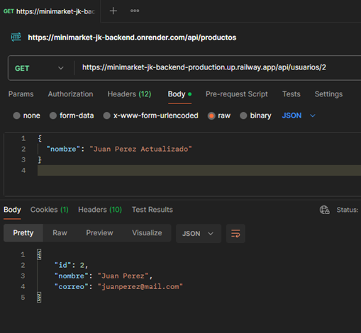

---

#### 6. Eliminar Usuario

Elimina un usuario del sistema.

- **Endpoint:** `/usuarios/{id}`
- **Método:** `DELETE`
- **Autenticación:** No especificada
- **Body:** No requiere

**Parámetros de URL:**

| Parámetro | Tipo | Descripción |
|-----------|------|-------------|
| id | string/number | ID del usuario a eliminar |

**Configuración en Postman:**
- **Method:** DELETE
- **URL:** `https://minimarket-jk-backend-production.up.railway.app/api/usuarios/{id}`
- **Headers:** Content-Type: application/json

**Ejemplo cURL:**
```bash
curl -X DELETE https://minimarket-jk-backend-production.up.railway.app/api/usuarios/1
```

**Ejemplo JavaScript:**
```javascript
const eliminarUsuario = async (id) => {
  const response = await fetch(`https://minimarket-jk-backend-production.up.railway.app/api/usuarios/${id}`, {
    method: 'DELETE',
    headers: {
      'Content-Type': 'application/json'
    }
  });
  
  const data = await response.json();
  console.log(data);
};

// Uso
eliminarUsuario(1);
```

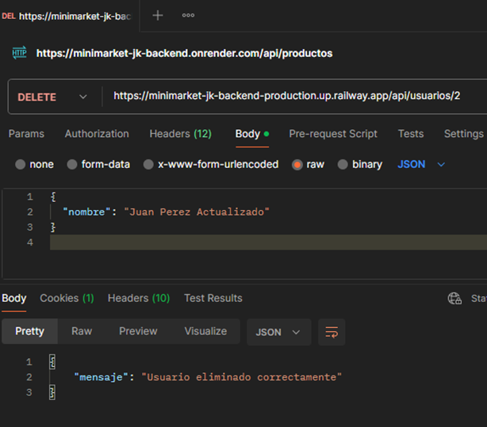

---

### Módulo Productos

#### 1. Obtener Todos los Productos

Lista todos los productos disponibles en el inventario.

- **Endpoint:** `/productos`
- **Método:** `GET`
- **Autenticación:** No requerida
- **Body:** No requiere

**Configuración en Postman:**
- **Method:** GET
- **URL:** `https://minimarket-jk-backend-production.up.railway.app/api/productos`
- **Headers:** Content-Type: application/json

**Ejemplo cURL:**
```bash
curl -X GET https://minimarket-jk-backend-production.up.railway.app/api/productos
```

**Ejemplo JavaScript:**
```javascript
const obtenerProductos = async () => {
  const response = await fetch('https://minimarket-jk-backend-production.up.railway.app/api/productos', {
    method: 'GET',
    headers: {
      'Content-Type': 'application/json'
    }
  });
  
  const data = await response.json();
  console.log(data);
};
```

**Ejemplo Python:**
```python
import requests

url = "https://minimarket-jk-backend-production.up.railway.app/api/productos"
response = requests.get(url)
print(response.json())
```

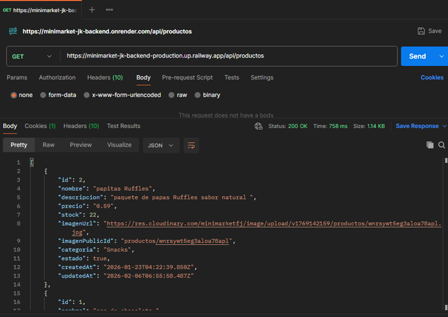

---

#### 2. Crear Producto

Crea un nuevo producto en el inventario.

- **Endpoint:** `/productos`
- **Método:** `POST`
- **Autenticación:** No especificada

**Parámetros del Body:**

| Campo | Tipo | Requerido | Descripción |
|-------|------|-----------|-------------|
| nombre | string | Sí | Nombre del producto |
| descripcion | string | Sí | Descripción detallada del producto |
| precio | string/number | Sí | Precio del producto en USD |
| stock | number | Sí | Cantidad disponible en inventario |
| categoria | string | Sí | Categoría del producto |
| imagenUrl | string | No | URL de la imagen del producto |

**Request Body:**
```json
{
  "nombre": "Arroz Diana 1kg",
  "descripcion": "Arroz blanco de grano largo, ideal para la preparación diaria de comidas",
  "precio": "1.15",
  "stock": 30,
  "categoria": "Abarrotes",
  "imagenUrl": "https://via.placeholder.com/300"
}
```

**Configuración en Postman:**
- **Method:** POST
- **URL:** `https://minimarket-jk-backend-production.up.railway.app/api/productos`
- **Headers:** Content-Type: application/json
- **Body:** raw → JSON

**Ejemplo cURL:**
```bash
curl -X POST https://minimarket-jk-backend-production.up.railway.app/api/productos \
  -H "Content-Type: application/json" \
  -d '{
    "nombre": "Arroz Diana 1kg",
    "descripcion": "Arroz blanco de grano largo, ideal para la preparación diaria de comidas",
    "precio": "1.15",
    "stock": 30,
    "categoria": "Abarrotes",
    "imagenUrl": "https://via.placeholder.com/300"
  }'
```

**Ejemplo JavaScript:**
```javascript
const crearProducto = async () => {
  const response = await fetch('https://minimarket-jk-backend-production.up.railway.app/api/productos', {
    method: 'POST',
    headers: {
      'Content-Type': 'application/json'
    },
    body: JSON.stringify({
      nombre: "Arroz Diana 1kg",
      descripcion: "Arroz blanco de grano largo, ideal para la preparación diaria de comidas",
      precio: "1.15",
      stock: 30,
      categoria: "Abarrotes",
      imagenUrl: "https://via.placeholder.com/300"
    })
  });
  
  const data = await response.json();
  console.log(data);
};
```

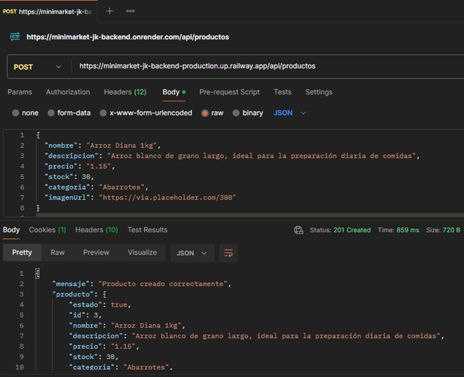

---

#### 3. Obtener Producto por ID

Obtiene la información de un producto específico.

- **Endpoint:** `/productos/{id}`
- **Método:** `GET`
- **Autenticación:** No especificada
- **Body:** No requiere

**Parámetros de URL:**

| Parámetro | Tipo | Descripción |
|-----------|------|-------------|
| id | string/number | ID del producto a consultar |

**Configuración en Postman:**
- **Method:** GET
- **URL:** `https://minimarket-jk-backend-production.up.railway.app/api/productos/{id}`
- **Headers:** Content-Type: application/json

**Ejemplo cURL:**
```bash
curl -X GET https://minimarket-jk-backend-production.up.railway.app/api/productos/1
```

**Ejemplo JavaScript:**
```javascript
const obtenerProductoPorId = async (id) => {
  const response = await fetch(`https://minimarket-jk-backend-production.up.railway.app/api/productos/${id}`, {
    method: 'GET',
    headers: {
      'Content-Type': 'application/json'
    }
  });
  
  const data = await response.json();
  console.log(data);
};

// Uso
obtenerProductoPorId(1);
```


---

#### 4. Actualizar Producto

Actualiza la información de un producto existente.

- **Endpoint:** `/productos/{id}`
- **Método:** `PUT`
- **Autenticación:** No especificada

**Parámetros de URL:**

| Parámetro | Tipo | Descripción |
|-----------|------|-------------|
| id | string/number | ID del producto a actualizar |

**Parámetros del Body (actualizables):**

| Campo | Tipo | Requerido | Descripción |
|-------|------|-----------|-------------|
| nombre | string | No | Nombre del producto |
| descripcion | string | No | Descripción del producto |
| precio | string/number | No | Precio del producto |
| stock | number | No | Cantidad en inventario |
| categoria | string | No | Categoría del producto |
| imagenUrl | string | No | URL de la imagen |

**Request Body (actualización parcial):**
```json
{
  "nombre": "Arroz Diana 1kg Premium",
  "precio": "1.25",
  "stock": 25
}
```

**Configuración en Postman:**
- **Method:** PUT
- **URL:** `https://minimarket-jk-backend-production.up.railway.app/api/productos/{id}`
- **Headers:** Content-Type: application/json
- **Body:** raw → JSON

**Ejemplo cURL:**
```bash
curl -X PUT https://minimarket-jk-backend-production.up.railway.app/api/productos/1 \
  -H "Content-Type: application/json" \
  -d '{
    "nombre": "Arroz Diana 1kg Premium",
    "precio": "1.25",
    "stock": 25
  }'
```

**Ejemplo JavaScript:**
```javascript
const actualizarProducto = async (id, datosActualizados) => {
  const response = await fetch(`https://minimarket-jk-backend-production.up.railway.app/api/productos/${id}`, {
    method: 'PUT',
    headers: {
      'Content-Type': 'application/json'
    },
    body: JSON.stringify(datosActualizados)
  });
  
  const data = await response.json();
  console.log(data);
};

// Uso
actualizarProducto(1, {
  nombre: "Arroz Diana 1kg Premium",
  precio: "1.25",
  stock: 25
});
```

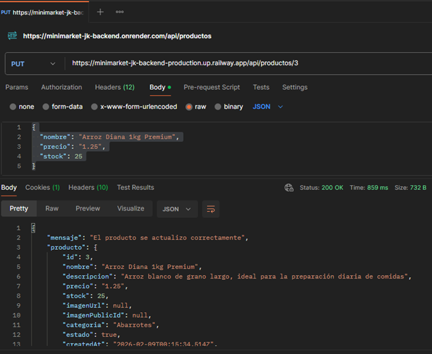

---

#### 5. Eliminar Producto

Elimina un producto del inventario.

- **Endpoint:** `/productos/{id}`
- **Método:** `DELETE`
- **Autenticación:** No especificada
- **Body:** No requiere

**Parámetros de URL:**

| Parámetro | Tipo | Descripción |
|-----------|------|-------------|
| id | string/number | ID del producto a eliminar |

**Configuración en Postman:**
- **Method:** DELETE
- **URL:** `https://minimarket-jk-backend-production.up.railway.app/api/productos/{id}`
- **Headers:** Content-Type: application/json

**Ejemplo cURL:**
```bash
curl -X DELETE https://minimarket-jk-backend-production.up.railway.app/api/productos/1
```

**Ejemplo JavaScript:**
```javascript
const eliminarProducto = async (id) => {
  const response = await fetch(`https://minimarket-jk-backend-production.up.railway.app/api/productos/${id}`, {
    method: 'DELETE',
    headers: {
      'Content-Type': 'application/json'
    }
  });
  
  const data = await response.json();
  console.log(data);
};

// Uso
eliminarProducto(1);
```

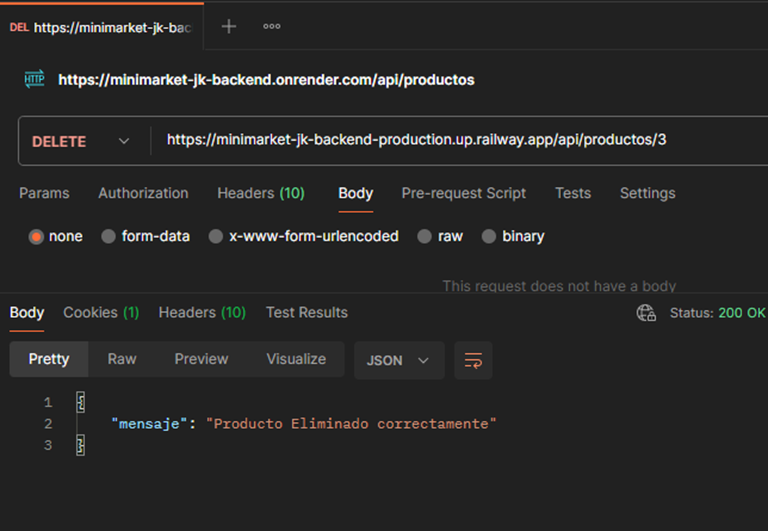

---

### Módulo Pedidos

#### 1. Crear Pedido

Crea un nuevo pedido en el sistema.

- **Endpoint:** `/pedidos`
- **Método:** `POST`
- **Autenticación:** No especificada

**Parámetros del Body:**

| Campo | Tipo | Requerido | Descripción |
|-------|------|-----------|-------------|
| nombreCliente | string | Sí | Nombre del cliente que realiza el pedido |
| metodoPago | string | Sí | Método de pago (EFECTIVO, TARJETA, etc.) |
| productos | array | Sí | Lista de productos del pedido |
| productos[].id | number | Sí | ID del producto |
| productos[].cantidad | number | Sí | Cantidad del producto |

**Request Body:**
```json
{
  "nombreCliente": "Carlos Gomez",
  "metodoPago": "EFECTIVO",
  "productos": [
    { "id": 1, "cantidad": 2 },
    { "id": 3, "cantidad": 1 }
  ]
}
```

**Configuración en Postman:**
- **Method:** POST
- **URL:** `https://minimarket-jk-backend-production.up.railway.app/api/pedidos`
- **Headers:** Content-Type: application/json
- **Body:** raw → JSON

**Ejemplo cURL:**
```bash
curl -X POST https://minimarket-jk-backend-production.up.railway.app/api/pedidos \
  -H "Content-Type: application/json" \
  -d '{
    "nombreCliente": "Carlos Gomez",
    "metodoPago": "EFECTIVO",
    "productos": [
      { "id": 1, "cantidad": 2 },
      { "id": 3, "cantidad": 1 }
    ]
  }'
```

**Ejemplo JavaScript:**
```javascript
const crearPedido = async () => {
  const response = await fetch('https://minimarket-jk-backend-production.up.railway.app/api/pedidos', {
    method: 'POST',
    headers: {
      'Content-Type': 'application/json'
    },
    body: JSON.stringify({
      nombreCliente: "Carlos Gomez",
      metodoPago: "EFECTIVO",
      productos: [
        { id: 1, cantidad: 2 },
        { id: 3, cantidad: 1 }
      ]
    })
  });
  
  const data = await response.json();
  console.log(data);
};
```

**Ejemplo Python:**
```python
import requests

url = "https://minimarket-jk-backend-production.up.railway.app/api/pedidos"
payload = {
    "nombreCliente": "Carlos Gomez",
    "metodoPago": "EFECTIVO",
    "productos": [
        {"id": 1, "cantidad": 2},
        {"id": 3, "cantidad": 1}
    ]
}

response = requests.post(url, json=payload)
print(response.json())
```

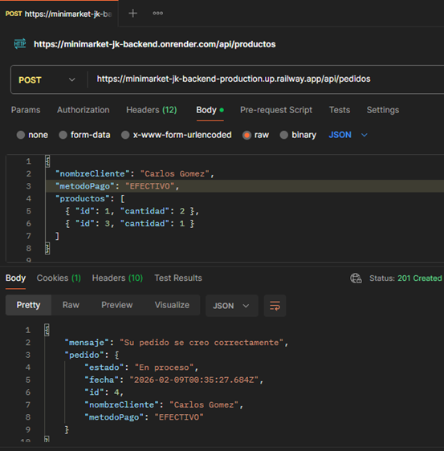

---

#### 2. Obtener Todos los Pedidos

Lista todos los pedidos registrados en el sistema.

- **Endpoint:** `/pedidos`
- **Método:** `GET`
- **Autenticación:** No especificada
- **Body:** No requiere

**Configuración en Postman:**
- **Method:** GET
- **URL:** `https://minimarket-jk-backend-production.up.railway.app/api/pedidos`
- **Headers:** Content-Type: application/json

**Ejemplo cURL:**
```bash
curl -X GET https://minimarket-jk-backend-production.up.railway.app/api/pedidos
```

**Ejemplo JavaScript:**
```javascript
const obtenerPedidos = async () => {
  const response = await fetch('https://minimarket-jk-backend-production.up.railway.app/api/pedidos', {
    method: 'GET',
    headers: {
      'Content-Type': 'application/json'
    }
  });
  
  const data = await response.json();
  console.log(data);
};
```

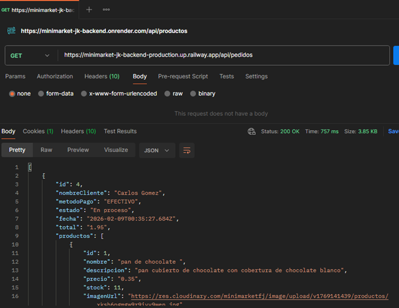

---

#### 3. Obtener Pedido por ID

Obtiene la información de un pedido específico.

- **Endpoint:** `/pedidos/{id}`
- **Método:** `GET`
- **Autenticación:** No especificada
- **Body:** No requiere

**Parámetros de URL:**

| Parámetro | Tipo | Descripción |
|-----------|------|-------------|
| id | string/number | ID del pedido a consultar |

**Configuración en Postman:**
- **Method:** GET
- **URL:** `https://minimarket-jk-backend-production.up.railway.app/api/pedidos/{id}`
- **Headers:** Content-Type: application/json

**Ejemplo cURL:**
```bash
curl -X GET https://minimarket-jk-backend-production.up.railway.app/api/pedidos/1
```

**Ejemplo JavaScript:**
```javascript
const obtenerPedidoPorId = async (id) => {
  const response = await fetch(`https://minimarket-jk-backend-production.up.railway.app/api/pedidos/${id}`, {
    method: 'GET',
    headers: {
      'Content-Type': 'application/json'
    }
  });
  
  const data = await response.json();
  console.log(data);
};

// Uso
obtenerPedidoPorId(1);
```

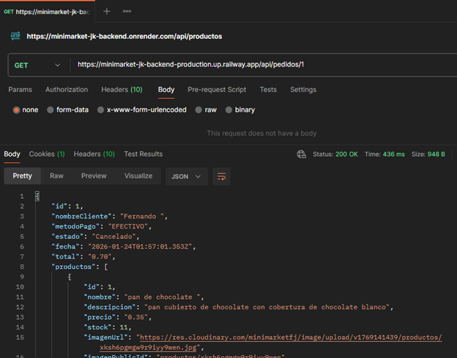

---

#### 4. Actualizar Estado del Pedido

Actualiza el estado de un pedido existente.

- **Endpoint:** `/pedidos/{id}`
- **Método:** `PUT`
- **Autenticación:** No especificada

**Parámetros de URL:**

| Parámetro | Tipo | Descripción |
|-----------|------|-------------|
| id | string/number | ID del pedido a actualizar |

**Parámetros del Body:**

| Campo | Tipo | Requerido | Descripción |
|-------|------|-----------|-------------|
| estado | string | Sí | Nuevo estado del pedido (Cancelado, Completado, etc.) |

**Request Body:**
```json
{
  "estado": "Cancelado"
}
```

**Configuración en Postman:**
- **Method:** PUT
- **URL:** `https://minimarket-jk-backend-production.up.railway.app/api/pedidos/{id}`
- **Headers:** Content-Type: application/json
- **Body:** raw → JSON

**Ejemplo cURL:**
```bash
curl -X PUT https://minimarket-jk-backend-production.up.railway.app/api/pedidos/1 \
  -H "Content-Type: application/json" \
  -d '{
    "estado": "Cancelado"
  }'
```

**Ejemplo JavaScript:**
```javascript
const actualizarEstadoPedido = async (id, nuevoEstado) => {
  const response = await fetch(`https://minimarket-jk-backend-production.up.railway.app/api/pedidos/${id}`, {
    method: 'PUT',
    headers: {
      'Content-Type': 'application/json'
    },
    body: JSON.stringify({ estado: nuevoEstado })
  });
  
  const data = await response.json();
  console.log(data);
};

// Uso
actualizarEstadoPedido(1, "Cancelado");
// O también: actualizarEstadoPedido(1, "Completado");
```

**Ejemplo Python:**
```python
import requests

url = "https://minimarket-jk-backend-production.up.railway.app/api/pedidos/1"
payload = {"estado": "Cancelado"}

response = requests.put(url, json=payload)
print(response.json())
```

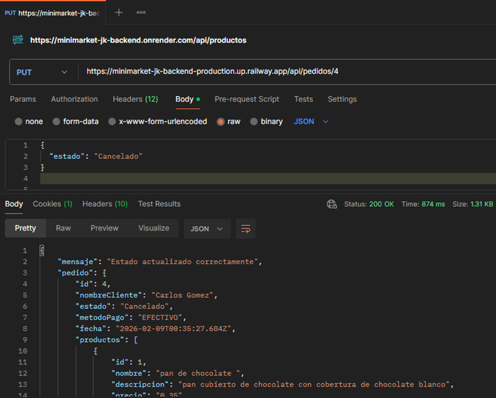

---

## 📊 Códigos de Respuesta

La API utiliza los siguientes códigos de estado HTTP estándar:

| Código | Significado | Descripción |
|--------|-------------|-------------|
| 200 | OK | Solicitud exitosa |
| 201 | Created | Recurso creado exitosamente |
| 400 | Bad Request | Solicitud inválida o parámetros incorrectos |
| 401 | Unauthorized | No autorizado, credenciales inválidas |
| 404 | Not Found | Recurso no encontrado |
| 500 | Internal Server Error | Error interno del servidor |

---

## 📋 Estructura de Respuestas

### Respuesta Exitosa

```json
{
  "success": true,
  "message": "Operación realizada exitosamente",
  "data": {
    // Datos del recurso
  }
}
```

### Respuesta de Error

```json
{
  "success": false,
  "message": "Descripción del error",
  "error": "Detalles técnicos del error"
}
```

---

## 🔍 Ejemplo de Flujo Completo

### Crear un pedido completo desde cero

```javascript
// 1. Registrar un usuario
const registrarUsuario = async () => {
  const response = await fetch('https://minimarket-jk-backend-production.up.railway.app/api/usuarios/registrar', {
    method: 'POST',
    headers: { 'Content-Type': 'application/json' },
    body: JSON.stringify({
      nombre: "Carlos Gomez",
      correo: "carlos@mail.com",
      contraseña: "123456"
    })
  });
  return await response.json();
};

// 2. Iniciar sesión
const login = async () => {
  const response = await fetch('https://minimarket-jk-backend-production.up.railway.app/api/usuarios/login', {
    method: 'POST',
    headers: { 'Content-Type': 'application/json' },
    body: JSON.stringify({
      correo: "carlos@mail.com",
      contrasena: "123456"
    })
  });
  return await response.json();
};

// 3. Obtener productos disponibles
const obtenerProductos = async () => {
  const response = await fetch('https://minimarket-jk-backend-production.up.railway.app/api/productos');
  return await response.json();
};

// 4. Crear un pedido
const crearPedido = async () => {
  const response = await fetch('https://minimarket-jk-backend-production.up.railway.app/api/pedidos', {
    method: 'POST',
    headers: { 'Content-Type': 'application/json' },
    body: JSON.stringify({
      nombreCliente: "Carlos Gomez",
      metodoPago: "EFECTIVO",
      productos: [
        { id: 1, cantidad: 2 },
        { id: 3, cantidad: 1 }
      ]
    })
  });
  return await response.json();
};

// 5. Verificar el pedido
const verificarPedido = async (pedidoId) => {
  const response = await fetch(`https://minimarket-jk-backend-production.up.railway.app/api/pedidos/${pedidoId}`);
  return await response.json();
};

// Ejecutar flujo completo
(async () => {
  const usuario = await registrarUsuario();
  console.log('Usuario registrado:', usuario);
  
  const sesion = await login();
  console.log('Sesión iniciada:', sesion);
  
  const productos = await obtenerProductos();
  console.log('Productos disponibles:', productos);
  
  const pedido = await crearPedido();
  console.log('Pedido creado:', pedido);
  
  const pedidoVerificado = await verificarPedido(pedido.data.id);
  console.log('Pedido verificado:', pedidoVerificado);
})();
```

---

## 📝 Notas Importantes

1. **Autenticación:** Actualmente la API no implementa tokens JWT en todas las rutas. Se recomienda implementar autenticación completa para producción.

2. **Validación:** Asegúrate de validar todos los datos antes de enviarlos a la API.

3. **CORS:** La API debe tener CORS configurado para permitir peticiones desde tu frontend.

4. **Manejo de Errores:** Implementa try-catch en tus llamadas para manejar errores adecuadamente.

5. **Stock de Productos:** Al crear un pedido, verifica que haya suficiente stock disponible.

6. **Variables de Entorno:** Nunca subas el archivo `.env` a tu repositorio. Usa `.env.example` como plantilla.

7. **Docker:** Asegúrate de tener Docker y Docker Compose instalados si quieres usar los contenedores.

8. **IMPORTANTE:** La API se encuentra alojada en la plataforma Railway bajo su plan gratuito, por lo que su disponibilidad depende de las limitaciones del servicio; en caso de que la API no se encuentre operativa debido a la finalización del período gratuito, se puede optar por desplegar el proyecto en plataformas alternativas como Render u otros servicios similares, o contratar un plan de pago para continuar utilizando Railway.

---

## 🤝 Contribución

Si deseas contribuir a este proyecto:

1. Fork el repositorio
2. Crea una rama para tu feature (`git checkout -b feature/NuevaCaracteristica`)
3. Commit tus cambios (`git commit -m 'Agregar nueva característica'`)
4. Push a la rama (`git push origin feature/NuevaCaracteristica`)
5. Abre un Pull Request

---

## 📧 Contacto

**Desarrollador:** Fernando Daniel Vaca Buitrón  
**Email:** fdvaca@puce.edu.ec  
**Universidad:** Pontificia Universidad Católica del Ecuador (PUCE)

---

## 📄 Licencia

Este proyecto fue desarrollado con fines académicos.

---

**Última actualización:** Febrero 2025

---

**⭐ Si este proyecto te fue útil, no olvides darle una estrella en GitHub!**